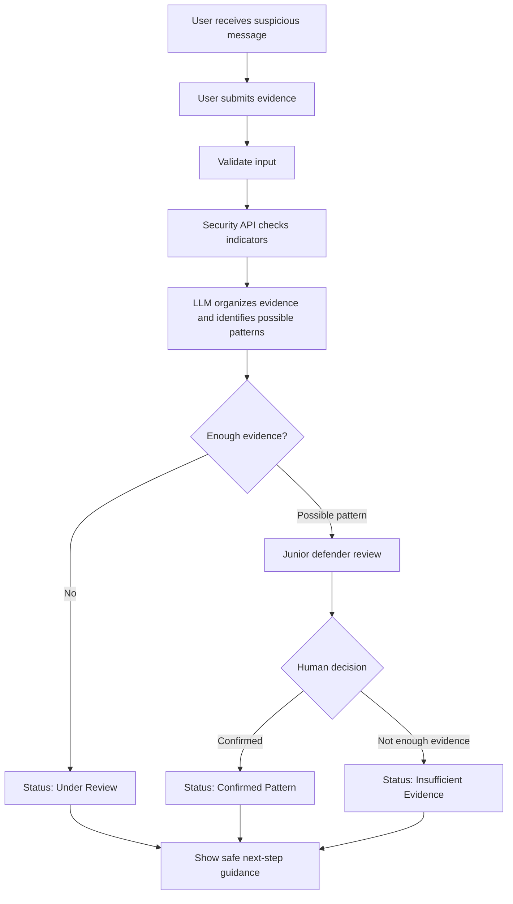
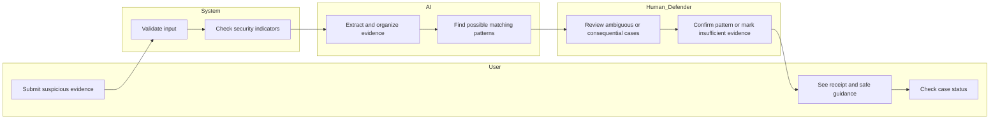
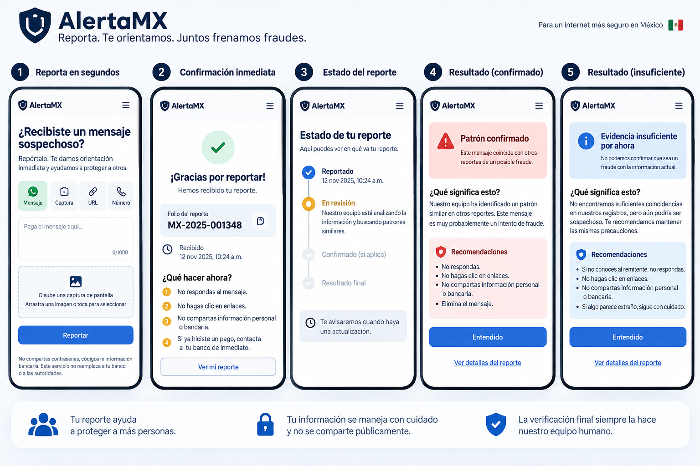

# PACKET — Week 8
Inés Escoto — USER

## Problem in my words
Mexican consumers receive suspicious WhatsApp messages, links, calls, payment requests, and screenshots but often do not know whether they are legitimate. The current burden is on the user to decide quickly, usually with very little context. This project creates a low-friction reporting flow where users can submit suspicious evidence, receive immediate safe guidance, and see the case status without the system pretending to know more than the evidence supports.
## Exact user

The primary user is an ordinary Mexican consumer who receives a suspicious WhatsApp message, link, payment request, phone number, or screenshot and does not have cybersecurity expertise. The user needs to report something suspicious quickly, understand what to do next, and avoid being forced to decide whether something is definitely a scam.

## Success definition

Before the module closes, a user can submit a suspicious message, URL, phone number, or screenshot, receive immediate safe guidance, and see a clear case status: Reported, Under Review, Confirmed Pattern, or Insufficient Evidence.

The system must never present an unverified report as confirmed.

## Feature flow

## Actor swimlane

## Benchmark line

The best existing benchmark for this problem is Singapore's ScamShield approach to coordinated anti-scam intelligence and user reporting.

Mine differs by focusing on a lightweight Mexican consumer reporting flow that works across suspicious messages, screenshots, URLs, and phone numbers while keeping human defenders responsible for confirmation.

## Long view

If this slice works, the product could become a shared cyber early-warning network for Mexican consumers. Reports from many users could help identify repeated scam patterns while trained defenders verify uncertain or consequential cases. Over time, confirmed intelligence could help banks, telecom companies, platforms, and consumers respond faster without turning AI into the final authority.

## Scope cut

This version will NOT:

- automatically accuse a person or company of fraud
- remove scams from external platforms
- contact banks or telecom companies automatically
- perform forensic investigations
- request passwords or financial credentials
- take remote control of a user's device
- store real personal data
- build a full notification network
- build authentication unless storage of personal user data becomes necessary

The working slice only proves the reporting, bounded analysis, safe-guidance, and status flow.

## Architecture + stack

| Layer | Tool | Purpose |
|---|---|---|
| Front end | Next.js | Reporting form, guidance, and status screen |
| LLM | LLM API | Structure submitted evidence and identify possible patterns without making final accusations |
| Security tooling/API | Threat-intelligence URL/indicator lookup API | Check submitted URLs or indicators against existing security information |
| Additional Dragon Stack element | Automation | Move a submitted case through the demo workflow and surface status changes |
| Hosting | Vercel | Free deployment |
| Repository | GitHub | Version control and required commits |

API keys will be stored only in Vercel environment variables and never committed to GitHub.

## Security floor

1. No API keys or secrets will be stored in the code or repository.
2. The prototype will not store real personal data.
3. If persistent user data is added, authentication and Row Level Security will be required before deployment.
4. Every submitted field will have type checks and length limits before reaching the database, API, or LLM.
5. All demo evidence and AI outputs will use invented data and will be clearly labeled as simulated where applicable.

## Test plan

### Mechanical test

Test that:

- the form accepts a valid suspicious-message report
- empty submissions are rejected
- overly long input is rejected
- a submitted report immediately shows a receipt
- safe guidance appears after submission
- the initial status is Reported or Under Review
- the interface never changes an unverified case directly to Confirmed without the human-review step
- simulated AI output is visibly labeled
- no API keys appear in the repository

At least one bug found during this pass will be documented, fixed, committed, and redeployed.

### Persona test

Synthetic user:

A Mexican consumer who regularly uses WhatsApp but has little cybersecurity knowledge. The user is worried after receiving a suspicious message and wants a fast answer without technical vocabulary.

The persona will be shown each prototype screen in order and asked:

1. What do you think this screen is telling you?
2. What would you do next?
3. What confuses you?
4. At what point would you stop using the product?

Every confusion will be logged. The worst confusion will be fixed before the final deployment.
## Image-generated mockup

The following mockup shows the intended reporting flow: submit suspicious evidence, receive immediate safe guidance, track the report status, and see either a confirmed pattern or insufficient evidence.

Mockup generated with AI. All examples shown are simulated.